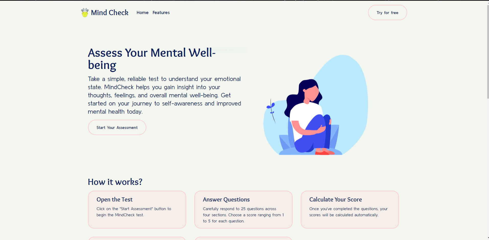

# Mind Check

    

Mind Check is a web application designed to help individuals assess and track their mental well-being. It provides users with a series of tests to evaluate various aspects of their mental health and provides personalized feedback based on the test results.

## Features

- **Free Test and Feedback**: Mind Check offers a collection of mental health tests that users can take for free. After completing a test, users receive personalized feedback based on their responses.

- **User Accounts**: Users have the option to create an account to store their test data and access additional features. Creating an account allows users to view their test history, track their progress over time, and receive recommendations for improving their mental well-being.

- **Secure Data Storage**: Mind Check utilizes Firebase, a cloud-based platform, for secure data storage and authentication. User data, including test results and personal information, is encrypted and protected.

- **AI-powered Feedback**: (Coming Soon!) The application leverages AI algorithms to provide customized feedback based on the user's test inputs. This feedback is designed to offer insights, suggestions, and resources to support the user's mental well-being.

## Tech Stack

The Mind Check application is built using the following technologies:

- **React**: A popular JavaScript library for building user interfaces. React provides a modular and efficient way to create interactive components.

- **TypeScript**: A typed superset of JavaScript that improves code maintainability and scalability. TypeScript enables static type checking, enhancing code reliability and developer productivity.

- **Vite**: A fast and lightweight development server and build tool for modern web applications. Vite offers quick startup times and efficient bundling, optimizing the overall development experience.

- **Firebase**: A comprehensive platform for building web and mobile applications. Mind Check utilizes Firebase for backend services, including authentication, data storage, and hosting. Firebase provides scalability, real-time updates, and robust security.

- **pnpm**: A fast and disk-space-efficient package manager. pnpm offers a lightweight alternative for managing project dependencies, optimizing package installation and update processes.

## Getting Started

To get started with Mind Check locally, follow these steps:

1. Clone the repository: `git clone https://github.com/kunalkeshan/Mind-Check.git`
2. Navigate to the project directory: `cd mind-check`
3. Install dependencies using pnpm: `pnpm install`
4. Start the development server: `pnpm dev`
   The app will be running at `http://localhost:5173`.

Make sure to set up your Firebase project and add the necessary environment variables as described in the CONTRIBUTING.md document.

## Contributing

If you're interested in contributing to Mind Check, please refer to the [Contributing Guidelines](CONTRIBUTING.md) for detailed information on how to get involved.

### 🤗 Project Contributors

## License

Mind Check is released under the MPL-V2.0 License. See the [LICENSE](LICENSE) file for more details.

### ⚔ Forking This Repo

Many people have contacted us asking if they can use this code for their own websites. The answer to that question is usually "yes", with attribution. There are some cases, such as using this code for a business or something that is greater than a personal project, that we may be less comfortable saying yes to. If in doubt, please don't hesitate to ask us.

We value keeping this project open source, but as you all know, plagiarism is bad. We actively spend a non-negligible amount of effort developing, designing, and trying to perfect this iteration of our project, and we are proud of it! All we ask is to not claim this effort as your own.

So, feel free to fork this repo. If you do, please just give us proper credit by linking back to this repo, [https://github.com/kunalkeshan/Mind-Check](https://github.com/kunalkeshan/Mind-Check). Refer to this handy [quora](https://www.quora.com/Is-it-bad-to-copy-other-peoples-code) post if you're not sure what to do. Thanks!

## Contact

If you have any questions or suggestions, feel free to reach out to the project maintainers at [https://github.com/kunalkeshan](https://github.com/kunalkeshan).

## References

- [Testing a React Application With Vitest](https://www.eternaldev.com/blog/testing-a-react-application-with-vitest/)
- [Env Variables and Modes in Vite](https://vitejs.dev/guide/env-and-mode.html)
- [Zustand](https://docs.pmnd.rs/zustand/getting-started/introduction)
- [Firebase rules based on authentication](https://stackoverflow.com/questions/60972889/firebase-firestore-rules-authenticated-access-to-all-collections-except-one)
